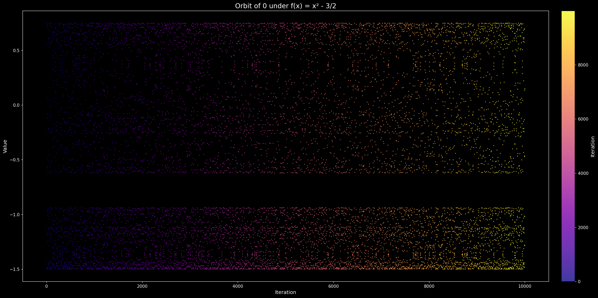
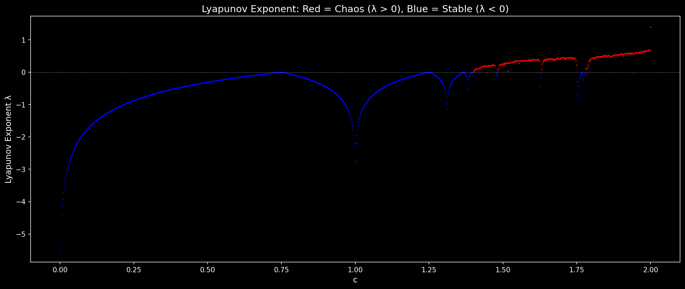

# Quadratic Map Orbit Analysis

Basic exploration of the dynamical behavior of the quadratic map f(x) = x² - c, specifically studying orbit iteration and chaos.






## Visualizations

The notebook includes several ways to visualize chaotic dynamics:

1. **Orbit Plot** — 10,000 iterations of f(x) = x² - 3/2 starting from 0, colored by iteration number
2. **Periodicity Check** — Confirms the orbit never exactly repeats (aperiodic)
3. **Cobweb Diagram** — Watch the orbit bounce between the parabola and diagonal line
4. **Invariant Density Histogram** — Shows where the orbit spends most of its time
5. **Return Map** — Plots x_{n+1} vs x_n, revealing the parabola structure
6. **Lyapunov Exponent** — Red = chaotic (λ > 0), blue = stable (λ < 0)
7. **Bifurcation Diagram** — The classic period-doubling cascade into chaos

## Key Findings

- With c = 3/2, the orbit is **chaotic**: bounded but aperiodic
- The orbit never exactly repeats (no duplicates found in 10,000 iterations)
- This places c = 3/2 in the chaotic regime of the quadratic family

## Background

This is the same family of maps used to define the Mandelbrot set. The Mandelbrot set consists of all c values where the orbit of 0 under f(x) = x² - c remains bounded. The transition from stable fixed points → periodic cycles → chaos as c increases is known as the period-doubling route to chaos (Feigenbaum).

| c value | Behavior |
|---------|----------|
| c < 0.25 | Converges to fixed point |
| 0.25 < c < 0.75 | Period-2 cycle |
| 0.75 < c < 1.25 | Period-doubling cascade |
| c ≈ 1.4 - 2 | Chaos (with periodic windows) |
| c > 2 | Escapes to infinity |

## Setup

```bash
python3 -m venv venv
source venv/bin/activate
pip install jupyterlab matplotlib numpy
jupyter lab
```
